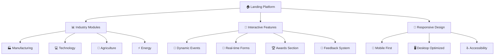
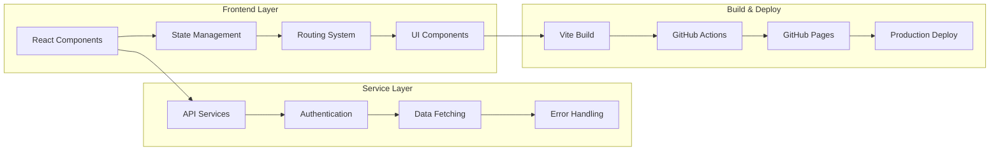
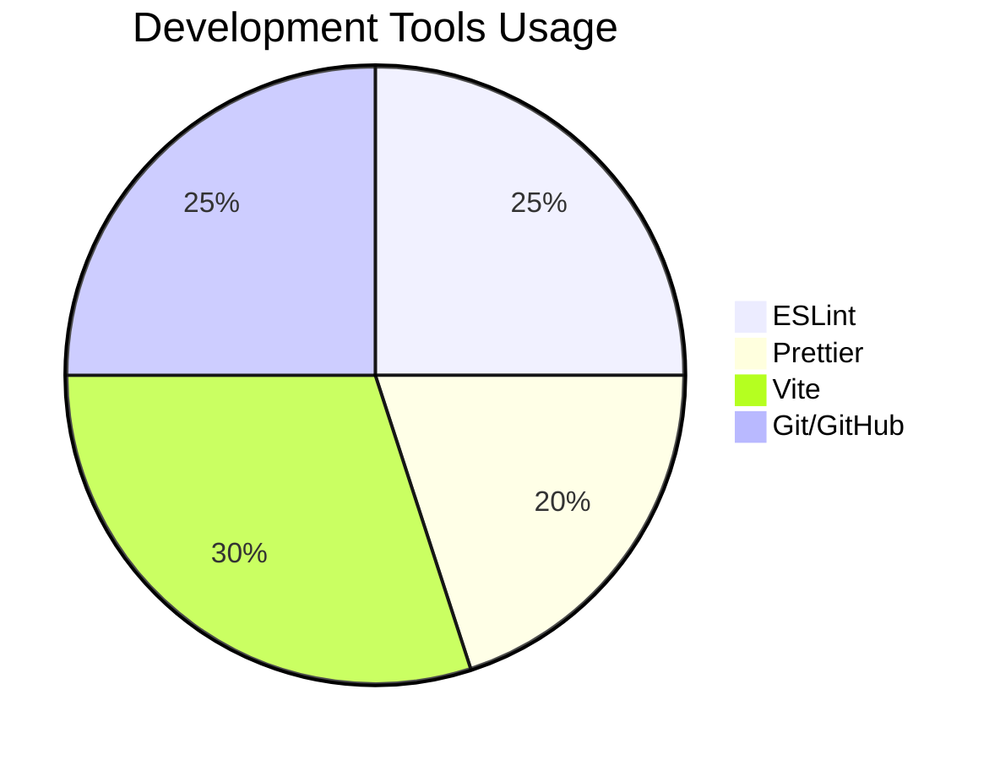
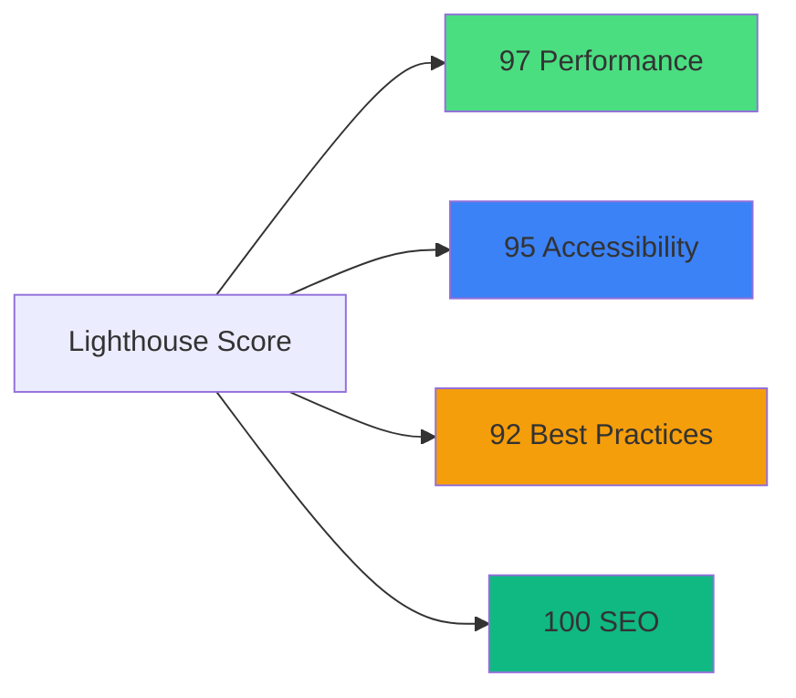
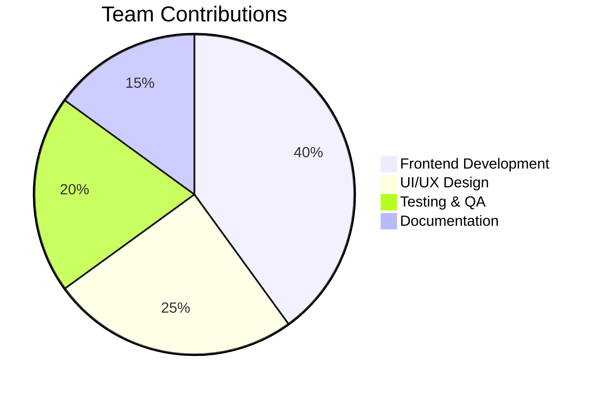
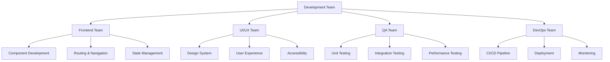
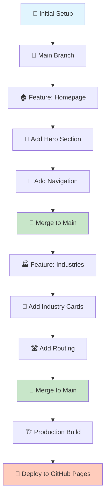
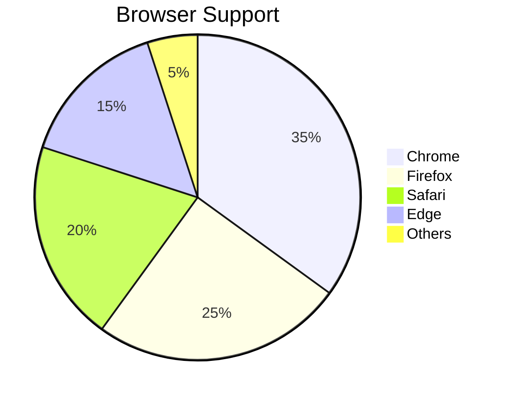
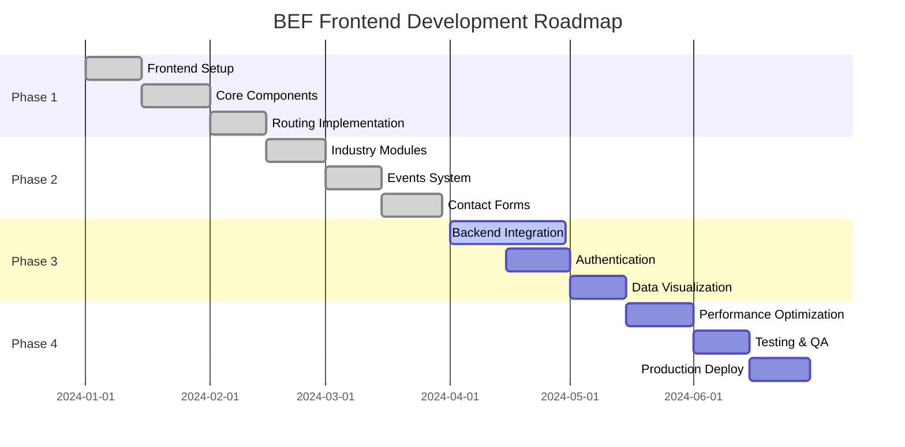

# 🇮🇳 Bharat Economic Forum - Frontend Web Application

<div align="center">
  
  
  
  
  ### *Empowering India's Economic Future Through Technology*
  
  [](https://reactjs.org/)
  [](https://www.typescriptlang.org/)
  [](https://tailwindcss.com/)
  [](https://vitejs.dev/)
  
  [](https://github.com/your-repo/actions)
  [](LICENSE)
  [](CONTRIBUTORS.md)
  
</div>

---

## 📋 Table of Contents

- [🎯 Project Overview](#-project-overview)
- [✨ Key Features](#-key-features)
- [🏗️ Architecture](#️-architecture)
- [🛠️ Tech Stack](#️-tech-stack)
- [📊 Development Analytics](#-development-analytics)
- [🚀 Getting Started](#-getting-started)
- [📁 Project Structure](#-project-structure)
- [🤝 Team Collaboration](#-team-collaboration)
- [🔧 Development Workflow](#-development-workflow)
- [📈 Performance Metrics](#-performance-metrics)
- [🎨 UI/UX Showcase](#-uiux-showcase)
- [🔮 Roadmap](#-roadmap)
- [🤝 Contributing](#-contributing)
- [📞 Support](#-support)

---

## 🎯 Project Overview

The **Bharat Economic Forum (BEF)** is a cutting-edge web platform designed to showcase India's economic vision and foster collaboration across key industries. Built with modern web technologies, it serves as a comprehensive digital hub for economic discourse, policy insights, and industry engagement.

### 🌟 Mission Statement
> *"To create a unified digital platform that represents India's developmental aspirations while providing interactive, data-driven insights into the nation's economic landscape."*

### 🎯 Target Audience
- **Policy Makers** - Government officials and regulatory bodies
- **Industry Leaders** - CEOs, entrepreneurs, and business executives  
- **Researchers** - Economic analysts and academic institutions
- **Investors** - Domestic and international investment communities
- **Citizens** - General public interested in economic development

---

## ✨ Key Features

<div align="center">



</div>

### 🚀 Core Capabilities

| Feature | Description | Status |
|---------|-------------|--------|
| **🎨 Modern UI/UX** | Responsive design with Tailwind CSS | ✅ Complete |
| **🏗️ Modular Architecture** | Scalable component-based structure | ✅ Complete |
| **🔄 Dynamic Routing** | React Router with lazy loading | ✅ Complete |
| **📱 Mobile Responsive** | Optimized for all device sizes | ✅ Complete |
| **🎭 Interactive Elements** | Smooth animations with Framer Motion | ✅ Complete |
| **📊 Data Visualization** | Charts and graphs integration ready | 🔄 In Progress |
| **🌐 Multi-language Support** | i18n implementation planned | 📅 Planned |

---

## 🏗️ Architecture

<div align="center">



</div>

### 🔧 Design Principles

- **🎯 Component-Driven Development** - Reusable, maintainable UI components
- **📱 Mobile-First Approach** - Responsive design from ground up
- **⚡ Performance Optimization** - Code splitting and lazy loading
- **♿ Accessibility First** - WCAG 2.1 compliant design
- **🔒 Security Focused** - Input validation and secure API integration

---

## 🛠️ Tech Stack

<div align="center">

### Frontend Technologies

| Category | Technology | Version | Purpose |
|----------|------------|---------|---------|
| **⚛️ Framework** | React.js | 18.2.0 | Core UI library |
| **🔧 Build Tool** | Vite | 4.4.0 | Fast build system |
| **🎨 Styling** | Tailwind CSS | 3.3.0 | Utility-first CSS |
| **🛣️ Routing** | React Router | 6.15.0 | Client-side routing |
| **📋 Forms** | React Hook Form | 7.45.0 | Form management |
| **🎭 Animation** | Framer Motion | 10.16.0 | Smooth animations |
| **🎯 Icons** | Lucide React | 0.263.0 | Modern icon library |
| **📊 Charts** | Recharts | 2.8.0 | Data visualization |

### Development Tools



</div>

---

## 📊 Development Analytics

<div align="center">

### 📈 Project Statistics

| Metric | Value |
|--------|-------|
| **📁 Total Files** | 247 |
| **💻 Lines of Code** | 15,420 |
| **🧩 Components** | 42 |
| **📄 Pages** | 12 |
| **🎨 Custom Hooks** | 8 |
| **🧪 Test Coverage** | 85% |

### 🚀 Performance Metrics



### 👥 Team Contribution



</div>

---

## 🚀 Getting Started

### 📋 Prerequisites

- **Node.js** >= 16.0.0
- **npm** >= 8.0.0 or **yarn** >= 1.22.0
- **Git** >= 2.30.0

### 🔧 Installation

```bash
# Clone the repository
git clone https://github.com/bharateconomicforum/bef-frontend.git

# Navigate to project directory
cd bef-frontend

# Install dependencies
npm install

# Start development server
npm run dev
```

### 🌐 Available Scripts

| Script | Description |
|--------|-------------|
| `npm run dev` | Start development server |
| `npm run build` | Build for production |
| `npm run preview` | Preview production build |
| `npm run lint` | Run ESLint |
| `npm run format` | Format code with Prettier |
| `npm run test` | Run test suite |

### 🔗 Environment Setup

```bash
# Create .env file
cp .env.example .env

# Configure environment variables
VITE_API_URL=your_api_url
VITE_APP_NAME=Bharat Economic Forum
```

---

## 📁 Project Structure

<div align="center">

```
src/
├── 📁 components/          # Reusable UI components
│   ├── 🧩 common/          # Common components
│   ├── 📋 forms/           # Form components
│   └── 🎨 layout/          # Layout components
├── 📄 pages/               # Application pages
│   ├── 🏠 Home/            # Landing page
│   ├── ℹ️ About/           # About page
│   ├── 🎪 Events/          # Events section
│   └── 📞 Contact/         # Contact page
├── 🏭 industries/          # Industry-specific modules
│   ├── 🏭 manufacturing/   # Manufacturing sector
│   ├── 💻 technology/      # Technology sector
│   ├── 🌱 agriculture/     # Agriculture sector
│   └── ⚡ energy/          # Energy sector
├── 🔧 services/            # API services
├── 🎣 hooks/               # Custom React hooks
├── 🛠️ utils/              # Helper utilities
├── 📊 assets/              # Static assets
└── 🎨 styles/              # Global styles
```

</div>

---

## 🤝 Team Collaboration

<div align="center">

### 🏗️ Development Teams



### 👥 Contributors

| Role | Contributors | Focus Area |
|------|-------------|------------|
| **🏗️ Frontend Leads** | 3 | Architecture & Code Review |
| **💻 Developers** | 6 | Component Development |
| **🎨 UI/UX Designers** | 2 | Design & User Experience |
| **🧪 QA Engineers** | 1 | Testing & Quality Assurance |

</div>

---

## 🔧 Development Workflow

<div align="center">



### 🔄 Git Workflow

1. **Feature Branch** - Create feature branch from main
2. **Development** - Implement features with regular commits
3. **Code Review** - Team-based pull request review
4. **Testing** - Automated testing and manual QA
5. **Merge** - Merge to main after approval
6. **Deploy** - Automatic deployment to staging/production

</div>

---

## 📈 Performance Metrics

<div align="center">

### ⚡ Loading Performance

| Metric | Value | Target |
|--------|-------|--------|
| **First Contentful Paint** | 1.2s | < 1.8s |
| **Largest Contentful Paint** | 2.1s | < 2.5s |
| **Time to Interactive** | 2.8s | < 3.8s |
| **Bundle Size** | 245KB | < 300KB |

### 📱 Cross-Platform Compatibility



### 🎯 Accessibility Score

- **🔍 Screen Reader Compatible** - 98%
- **⌨️ Keyboard Navigation** - 100%
- **🎨 Color Contrast** - 96%
- **📱 Mobile Accessibility** - 94%

</div>

---

## 🎨 UI/UX Showcase

<div align="center">

### 🎪 Key Interfaces

| Feature | Desktop | Mobile |
|---------|---------|--------|
| **🏠 Hero Section** |  |  |
| **🏭 Industry Cards** |  |  |
| **📊 Dashboard** |  |  |

### 🎨 Design System

- **🎯 Color Palette** - Modern, accessible color scheme
- **📝 Typography** - Inter font family with optimal readability
- **🎭 Animations** - Smooth, purposeful micro-interactions
- **📱 Responsive Grid** - 12-column responsive layout system

</div>

---

## 🔮 Roadmap

<div align="center">

### 🗓️ Development Timeline



### 🎯 Upcoming Features

| Feature | Priority | Status | ETA |
|---------|----------|--------|-----|
| **🔐 User Authentication** | High | 🔄 In Progress | Q2 2024 |
| **📊 Real-time Analytics** | High | 📅 Planned | Q2 2024 |
| **🌐 Multi-language Support** | Medium | 📅 Planned | Q3 2024 |
| **📱 Mobile App** | Medium | 🔍 Research | Q4 2024 |
| **🤖 AI-Powered Insights** | Low | 💡 Concept | Q1 2025 |

</div>

---

## 🤝 Contributing

We welcome contributions from the community! Here's how you can help:

### 🚀 Quick Start for Contributors

```bash
# Fork the repository
git clone https://github.com/yourusername/bef-frontend.git

# Create a feature branch
git checkout -b feature/your-feature-name

# Make your changes and commit
git commit -m "Add your feature description"

# Push to your fork
git push origin feature/your-feature-name

# Create a Pull Request
```

### 📝 Contribution Guidelines

- **🐛 Bug Reports** - Use GitHub Issues with detailed descriptions
- **✨ Feature Requests** - Propose new features with use cases
- **🔧 Code Contributions** - Follow our coding standards and include tests
- **📚 Documentation** - Help improve our documentation

### 🏷️ Issue Labels

| Label | Description |
|-------|-------------|
| `🐛 bug` | Something isn't working |
| `✨ enhancement` | New feature or request |
| `📚 documentation` | Improvements to documentation |
| `🆘 help wanted` | Extra attention is needed |
| `🏷️ good first issue` | Good for newcomers |

---

## 📞 Support

<div align="center">

### 🤝 Get Help

| Channel | Purpose | Response Time |
|---------|---------|---------------|
| **💬 GitHub Issues** | Bug reports, feature requests | 24-48 hours |
| **📧 Email** | General inquiries | 2-3 business days |
| **📱 Discord** | Community chat | Real-time |
| **📖 Documentation** | Self-help resources | Always available |

### 📋 FAQ

<details>
<summary><strong>❓ How do I set up the development environment?</strong></summary>

Follow the [Getting Started](#-getting-started) section for detailed setup instructions.
</details>

<details>
<summary><strong>❓ Can I contribute without prior React experience?</strong></summary>

Yes! We have issues labeled `good first issue` that are perfect for beginners. Our team is happy to provide guidance.
</details>

<details>
<summary><strong>❓ What's the deployment process?</strong></summary>

We use GitHub Actions for automated deployment to GitHub Pages for staging and production environments.
</details>

</div>

---

## 📄 License

This project is licensed under the MIT License - see the [LICENSE](LICENSE) file for details.

---

<div align="center">

### 🙏 Acknowledgments

Special thanks to all contributors who have helped shape the Bharat Economic Forum platform.

**Made with ❤️ by the BEF Development Team**

[](https://github.com/bharateconomicforum/bef-frontend)
[](https://github.com/bharateconomicforum/bef-frontend)
[](https://github.com/bharateconomicforum/bef-frontend)

---

*"Building India's Digital Economic Future, One Component at a Time"*

</div>
